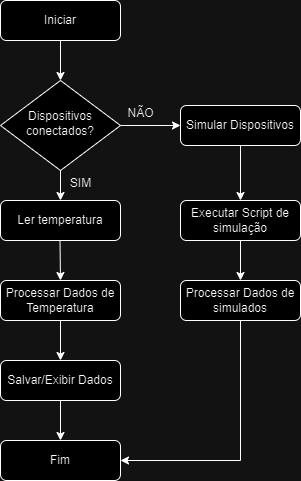

# Hardware

Neste repositório estão contidos os códigos fonte relacionados à parte de *hardware* do projeto.

## *Hardware* Atual em Uso

Inicialmente, foram realizadas tentativas de uso do kit de desenvolvimento DE10-nano. Entretanto, foi verificado que a implementação do barramento One-Wire seria custosa e poderia não ter a estabilidade necessária para os testes com o sensor DS18B20. Outra alternativa foi utilizar o Raspberry Pi 3 Model B, que já possui um barramento One-Wire implementado. Foram realizados testes bem-sucedidos com o sensor em modo parasita. Para tal, foi criado o *script* [`ler_temperatura`](testes/ler_temperatura), na linguagem Bash.

### Características do Ambiente de Desenvolvimento

- **Placa**: Raspberry Pi 3 Model B
- **CPU**: ARM Cortex-A53 + (4) @ 1.20 GHz (64-bits)
- **Memória**: 1 GB
- **Sistema Operacional**: openSUSE Tumbleweed (aarch64)
- **Kernel**: 6.8.9-1-default
- **Python**: 3.11.9

## Testes em Linguagens de Alto Nível

Para verificar o funcionamento do barramento One-Wire no Raspberry Pi 3, foi implementado um teste simples na linguagem Bash e outro mais elaborado na linguagem Python. Veja mais informações [aqui](testes/README.md).

## Diagrama de Blocos



## Estrutura do Projeto

```plaintext
Projeto hardware-main
|
|-- Bibliotecas
|   |-- jpmsb.py
|
|-- Testes
    |-- Python
    |   |-- exemplo.py
    |   |-- jpmsb.py
    |
    |-- Shell
    |   |-- ler_temperatura
    |   |-- w1_simulation
    |
    |-- W1 Configuração e Leitura
        |-- sys/bus/w1/devices/
            |-- w1_master_pullup
            |-- w1_master_remove
            |-- w1_master_search
            |-- w1_master_slaves
            |-- temperature
```

### Diretório `bibliotecas`

Contém bibliotecas de scripts Python.

#### Arquivos Importantes

- **jpmsb.py**: Script Python com funções e classes reutilizáveis.

### Diretório `testes`

Contém scripts e arquivos de teste para o hardware.

#### Subdiretório `python`

- **exemplo.py**: Script de exemplo para testes em Python.
- **jpmsb.py**: Funções de teste em Python.

#### Subdiretório `shell`

- **ler_temperatura**: Script de shell para leitura de temperatura de sensores W1.
- **w1_simulation**: Script de shell para simulação de dispositivos W1.

#### Subdiretório `sys/bus/w1/devices`

Contém arquivos de configuração e leitura para dispositivos W1.

### Arquivos de Configuração W1

- **w1_master_pullup**: Configuração para ativar o pull-up no barramento W1.
- **w1_master_remove**: Configuração para remover dispositivos do barramento W1.
- **w1_master_search**: Configuração para buscar dispositivos no barramento W1.
- **w1_master_slaves**: Lista de dispositivos escravos no barramento W1.
- **temperature**: Leitura de temperatura de dispositivos específicos.


# One-Wire DS18B20 Sensor Management Library

## Descrição

Esta biblioteca em Python é projetada para gerenciar sensores de temperatura DS18B20 conectados via barramentos 1-wire no sistema de arquivos Linux. A classe principal `onewire` é responsável por detectar e gerenciar barramentos 1-wire e sensores DS18B20, enquanto a classe `sensor` fornece uma interface de alto nível para interagir com os sensores.

## Estrutura da Classe `onewire`

### Construtor

```python
def __init__(self, w1_system_path='/sys/bus/w1/devices', search_tries=20)
```
- **w1_system_path**: Caminho para os dispositivos 1-wire no sistema de arquivos.
- **search_tries**: Número de tentativas para limpar a busca de sensores.

### Métodos

- **clean_search(w1_bus)**: Realiza uma busca limpa no barramento 1-wire especificado.
- **search_w1_buses(w1_system_path)**: Procura por barramentos 1-wire disponíveis.
- **search_sensors(w1_bus)**: Procura por sensores DS18B20 em um barramento 1-wire específico.
- **search_all_sensors()**: Procura por sensores em todos os barramentos 1-wire.
- **set_value(w1_bus, property_name, value)**: Define valores nos pseudo-arquivos de um barramento 1-wire.
- **set_search(w1_bus, value)**: Define a busca de sensores em um barramento 1-wire.
- **set_pullup(w1_bus, value)**: Define o pull-up de um barramento 1-wire.
- **list_w1_buses()**: Retorna a lista de barramentos 1-wire.
- **list_sensors(w1_bus_number)**: Retorna uma lista de sensores DS18B20 em um barramento 1-wire.
- **get_temperature(w1_bus_number, sensor_id)**: Retorna o valor de temperatura de um sensor DS18B20 pelo ID.
- **get_address(w1_bus_number, sensor_id)**: Obtém o endereço de um sensor DS18B20.

## Estrutura da Classe `sensor`

### Construtor

```python
def __init__(self, w1_system_path='/sys/bus/w1/devices')
```
- **w1_system_path**: Caminho para os dispositivos 1-wire no sistema de arquivos.

### Métodos

- **new_search()**: Realiza uma nova busca limpa em todos os barramentos 1-wire.
- **get_temperature(w1_bus_number)**: Retorna a temperatura do sensor DS18B20 no barramento especificado.
- **get_address(w1_bus_number)**: Obtém o endereço do sensor DS18B20 no barramento especificado.
- **list_w1_buses()**: Retorna a lista de barramentos 1-wire.
- **list_sensors()**: Retorna uma lista de sensores DS18B20 detectados.
- **get_sensor_amount()**: Retorna a quantidade de sensores DS18B20 detectados.

## Exemplo de Uso

```python
from onewire import sensor

# Instanciando a classe sensor
s = sensor()

# Listando barramentos 1-wire
print(s.list_w1_buses())

# Listando sensores conectados
print(s.list_sensors())

# Obtendo a temperatura do primeiro sensor no primeiro barramento
print(s.get_temperature(1))

# Obtendo o endereço do primeiro sensor no primeiro barramento
print(s.get_address(1))

# Realizando uma nova busca de sensores
s.new_search()
```


## Instruções de Uso

### Configuração do Ambiente

1. **Clone o Repositório**:
   ```bash
   git clone <URL-do-repositório>
   cd hardware-main
   ```

2. **Configure o Ambiente Python**:
   - Crie um ambiente virtual e instale as dependências.
   ```bash
   python -m venv env
   source env/bin/activate
   pip install -r requirements.txt
   ```

3. **Configuração da Raspberry Pi**:
   - Certifique-se de que a Raspberry Pi está configurada corretamente para interagir com os dispositivos W1. 
   - Adicione as seguintes linhas ao final do arquivo `/boot/config.txt`:
   ```bash
   dtoverlay=w1-gpio
   ```

### Testes com Sensores W1

1. **Scripts de Shell**:
   - Utilize os scripts de shell no diretório `testes/shell` para interagir com os sensores W1.
   ```bash
   sh testes/shell/ler_temperatura
   sh testes/shell/w1_simulation
   ```

2. **Leitura de Temperatura**:
   - Verifique as leituras de temperatura nos arquivos localizados em `testes/sys/bus/w1/devices`.

## Contribuição

1. **Fork o Projeto**:
   - Faça um fork do projeto no GitHub e clone o repositório.

2. **Crie uma Branch**:
   - Crie uma branch para suas modificações.
   ```bash
   git checkout -b minha-nova-feature
   ```

3. **Commit suas Alterações**:
   - Faça commit das suas alterações.
   ```bash
   git commit -m "Adicionei uma nova feature"
   ```

4. **Faça Push**:
   - Envie suas alterações para o GitHub.
   ```bash
   git push origin minha-nova-feature
   ```

5. **Crie um Pull Request**:
   - Abra um pull request no repositório original.

---
## Notas

- Esta biblioteca requer permissões adequadas para acessar os arquivos do sistema de barramento 1-wire.
- Certifique-se de que os módulos do kernel necessários estão carregados para suportar dispositivos 1-wire.

---
