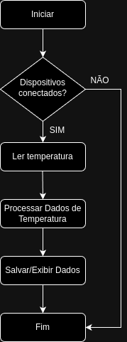

# Hardware

Neste repositório estão contidos os códigos fonte relacionados à parte de *hardware* do projeto.

### Sumário

- [Hardware](#hardware)
  - [Características do Ambiente de Desenvolvimento](#características-do-ambiente-de-desenvolvimento)
  - [Testes em Linguagens de Alto Nível](#testes-em-linguagens-de-alto-nível)
  - [Diagrama de Blocos](#diagrama-de-blocos)
  - [Estrutura do Projeto](#estrutura-do-projeto)
    - [Diretório `bibliotecas`](#diretório-bibliotecas)
      - [Arquivos Importantes](#arquivos-importantes)
    - [Arquivos de Configuração W1](#arquivos-de-configuração-w1)
  - [Instruções de Uso](#instruções-de-uso)
    - [Preparação do cartão de memória](#preparação-do-cartão-de-memória)
      - [Expansão do Sistema de Arquivos](#expansão-do-sistema-de-arquivos)
    - [Configuração do Ambiente](#configuração-do-ambiente)
      - [Instalação do Docker](#instalação-do-docker)

## *Hardware* atual em uso

Inicialmente, foram realizadas tentativas de uso do kit de desenvolvimento DE10-nano. Entretanto, foi verificado que a implementação do barramento One-Wire seria custosa e poderia não ter a estabilidade necessária para os testes com o sensor DS18B20. Outra alternativa foi utilizar o Raspberry Pi 3 Model B, que já possui driver de barramento One-Wire implementado. Foram realizados testes bem-sucedidos com o sensor em modo parasita.

### Características do Ambiente de Desenvolvimento

- **Placa**: Raspberry Pi 3 Model B
- **CPU**: ARM Cortex-A53 + (4) @ 1.20 GHz (64-bits)
- **Memória**: 1 GB
- **Sistema Operacional**: openSUSE Tumbleweed (aarch64)
- **Kernel**: 6.10.5-1-default
- **Python**: 3.11.9

## Testes em Linguagens de Alto Nível

Para verificar o funcionamento do barramento One-Wire no Raspberry Pi 3, foi implementado um teste simples na linguagem Bash e outro mais elaborado na linguagem Python. Veja mais informações [aqui](testes/README.md).

## Diagrama de Blocos



## Estrutura do Projeto

```plaintext
Projeto hardware-main
|
|-- Bibliotecas
|   |-- jpmsb.py
|
|-- Testes
    |-- Python
    |   |-- exemplo.py
    |   |-- jpmsb.py
    |
    |-- Shell
    |   |-- ler_temperatura
    |   |-- w1_simulation
    |
    |-- W1 Configuração e Leitura
        |-- sys/bus/w1/devices/
            |-- w1_master_pullup
            |-- w1_master_remove
            |-- w1_master_search
            |-- w1_master_slaves
            |-- temperature
```

### Diretório `bibliotecas`

Contém bibliotecas de scripts Python.

#### Arquivos Importantes

- **jpmsb.py**: Biblioteca para abstrair a interação com os componentes do barramento 1-Wire.

### Arquivos de Configuração W1

- **w1_master_pullup**: Configuração para ativar o pull-up no barramento W1.
- **w1_master_remove**: Configuração para remover dispositivos do barramento W1.
- **w1_master_search**: Configuração para buscar dispositivos no barramento W1.
- **w1_master_slaves**: Lista de dispositivos escravos no barramento W1.
- **temperature**: Leitura de temperatura de dispositivos específicos.

## Instruções de Uso

### Preparação do cartão de memória

Primeiramente, baixe a imagem de cartão com o sistema operacional. Neste projeto, foi utilizado o openSUSE Tumbleweed para Raspberry Pi 3, que pode ser baixado [aqui](http://download.opensuse.org/ports/aarch64/tumbleweed/appliances/openSUSE-Tumbleweed-ARM-JeOS-raspberrypi.aarch64.raw.xz).

Após baixar a imagem, descompacte o arquivo e grave-o em um cartão de memória, utilizando o comando abaixo:

```bash
xzcat openSUSE-Tumbleweed-ARM-JeOS-raspberrypi.aarch64.raw.xz | dd bs=4M of=/dev/sdX iflag=fullblock oflag=direct status=progress; sync
```

Este processo pode levar vários minutos. Após finalizado, insira o cartão no Raspberry Pi e ligue-o. O sistema operacional será inicializado e você poderá acessá-lo via SSH, sendo o login `root` e a senha `linux`.

#### Expansão do Sistema de Arquivos

Após a primeira inicialização, é recomendável expandir o sistema de arquivos para ocupar todo o cartão de memória. Para isso, instale a ferramenta `growpart` com o comando:

```bash
zypper install growpart
```

E expanda a partição raiz (3) com o comando:

```bash
growpart /dev/mmcblk0 3
```

Em seguida, redimensione o sistema de arquivos com o comando:

```bash
resize2fs /dev/mmcblk0p3
```

### Configuração do Ambiente

O arquivo `/boot/extraconfig.txt` permite a adição de configurações extras para o Raspberry Pi. No exemplo abaixo, estão configurados 6 barramentos W1:

   ```
   dtoverlay=w1-gpio,gpiopin=9
   dtoverlay=w1-gpio,gpiopin=10
   dtoverlay=w1-gpio,gpiopin=22
   dtoverlay=w1-gpio,gpiopin=27
   dtoverlay=w1-gpio,gpiopin=17
   dtoverlay=w1-gpio,gpiopin=4
   ```

A ordem em que os pinos são especificados determina qual a posição do barramento no sistema. Dessa forma, a contagem começa a partir da última linha de configuração. No exemplo acima, a ordem fica da seguinte forma:

- w1_bus_master1 &rarr; GPIO 4
- w1_bus_master2 &rarr; GPIO 17
- w1_bus_master3 &rarr; GPIO 27
- w1_bus_master4 &rarr; GPIO 22
- w1_bus_master5 &rarr; GPIO 10
- w1_bus_master6 &rarr; GPIO 9

Isso é utilizado para a localização física do sensor, sendo que este projeto assume apenas um sensor por barramento.

Após esses ajustes, reinicie o sistema.

#### Instalação do Docker

Para facilitar a organização do serviços, foram utilizados contêineres gerenciados pela ferramenta Docker. Para instalar o Docker, execute os comandos abaixo:

```bash
zypper install docker docker-compose
```

Em seguida, inicie o serviço e habilite-o para iniciar automaticamente:

```bash
systemctl enable --now docker
```